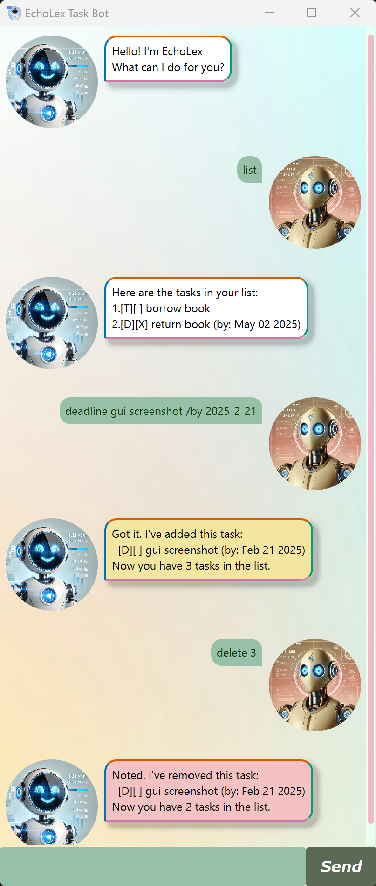

# EchoLex User Guide



**EchoLex** is a simple, command-based task management chatbot designed to help you keep track of your tasks effortlessly. 

Whether you're managing to-do lists, deadlines, or events, EchoLex offers a straightforward interface where you can interact with your task list through natural language commands.

## Task Types

* Todos `[T]`
* Deadlines `[D]`
* Events `[E]`

| Type | Letter | Remarks                               |
| ---- | --- |---------------------------------------|
| Todos | `T` | No relevant date                      |
| Deadlines | `D` | By a certain date                     |
| Events | `E` | From a certain date to a certain date |


## Listing Tasks

List the tasks in your task list.

### Usage

Example: `list`

A numbered list of tasks displayed in the order in which the tasks are added, with the format: 
`<task-index>.[<task-type>][<completion-status>] <description> (<optional-date>)`

```
Here are the tasks in your list:
1.[T][] borrow book
2.[D][X] read book (by: May 02 2025)
3.[E][] book discussion (from: May 03 2025 to: May 05 2025)
```


## Adding Tasks

Add a task to your task list.

### Usage

Format: `<task-type> <decription> (optional arguments)`

Example: `event book discussion /from 03-05-2025 /to 05-05-2025`

Task addition result will be displayed, alongside the current number of tasks in the task list.

```
Got it. I've added this task:
  [E][] book discussion (from: May 03 2025 to: May 05 2025)
Now you have 3 tasks in the list.
```


## Marking / Unmarking Tasks

Mark a task in your task list as done / not done.

### Usage

Format: `mark <task-index>`

Example: `mark 2`

Task marking result will be displayed.

```
Nice! I've marked this task as done:
  [D][X] return book (by: May 02 2025)
```


## Finding Tasks

Find a task in your task list using a keyword.

### Usage

Format: `find <keyword>`

Example: `find discussion`

A numbered list of tasks matching the keyword will be displayed.

```
1.[E][] book discussion (from: May 03 2025 to: May 05 2025)
```

**WARNING:** the number **DOES NOT** represent the task index.


## Deleting Tasks

Delete a task in your task list.

### Usage

Format: `delete <task-index>`

Example: `delete 3`

Task deletion result will be displayed, alongside the remaining number of tasks in the task list.

```
Noted. I've removed this task:
  [E][] book discussion (from May 03 2025 to: May 05 2025)
Now you have 2 tasks in the list.
```


## Viewing Task Schedule

View your upcoming tasks for today, tomorrow, and the week ahead.
You can also view the event schedule for a specific day.

### Usage

Format: `schedule (optional arguments)`

Example: `schedule`

Shows your upcoming events for the next 3 days, and your upcoming deadlines for the next 7 days.

```
Here is your Event Schedule for Today:
No Events! Have a relaxing day!

Here is your Event Schedule for the next 3 days:
1.[E][] book discussion (from: May 03 2025 to: May 05 2025)

Here are your deadlines in the next 7 days:
1.[D][] return book (by: May 02 2025)
```

**WARNING:** the number **DOES NOT** represent the task index.